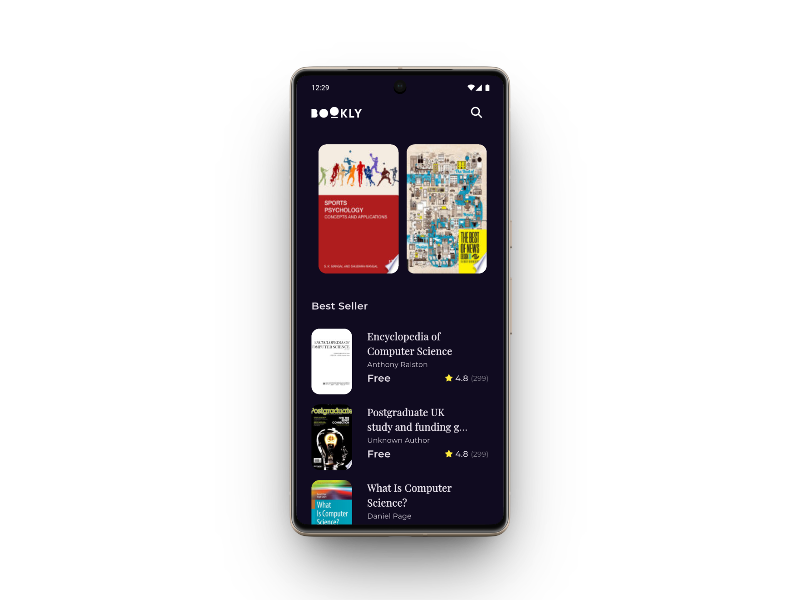

# 📚 Bookly App

 
A sophisticated book browsing application built with **Flutter**, designed to provide a seamless reading discovery experience. The app leverages the **Google Books API** to fetch and display books, featuring a modern UI with smooth animations and robust error handling.

## 📱 Screenshots

| Home Screen | Book Details |
|:-----------:|:------------:|
|  |  |
## ✨ Features

- **Clean & Modern UI:** Implemented a pixel-perfect design with a focus on user experience.
- **Smooth Performance:** Utilized `CustomScrollView` and `Slivers` for efficient scrolling and complex layouts.
- **State Management:** Powered by **Cubit (Bloc)** for predictable state management.
- **API Integration:** Fetched data from Google Books API using **Dio** with interceptors and error handling.
- **Loading Effects:** Integrated **Shimmer** effects for a polished loading experience.
- **Routing:** Managed navigation using **GoRouter** for deep linking and organized routes.
- **Cached Images:** Optimized network image loading and caching.

## 🛠️ Tech Stack & Libraries

- **Framework:** [Flutter](https://flutter.dev/) & [Dart](https://dart.dev/)
- **Architecture:** MVVM / Clean Architecture
- **State Management:** [flutter_bloc](https://pub.dev/packages/flutter_bloc)
- **Networking:** [dio](https://pub.dev/packages/dio)
- **Routing:** [go_router](https://pub.dev/packages/go_router)
- **UI Utilities:**
  - [cached_network_image](https://pub.dev/packages/cached_network_image)
  - [shimmer](https://pub.dev/packages/shimmer)
  - [url_launcher](https://pub.dev/packages/url_launcher)

 

## 📂 Project Structure

The project follows the **Feature-First** architecture (Clean Architecture principles):

```text
lib/
├── core/                   # Shared utilities, errors, and widgets
├── features/
│   ├── home/               # Home feature (Presentation, Data, Domain)
│   ├── search/             # Search feature
│   └── splash/             # Splash screen
├── main.dart
└── constants.dart
```
🎨 Design Credit
The UI design was provided as part of the Flutter Advanced Course by Tharwat Samy. My role focused on the architectural implementation, logic handling, and converting the design into a functional, performant application.
